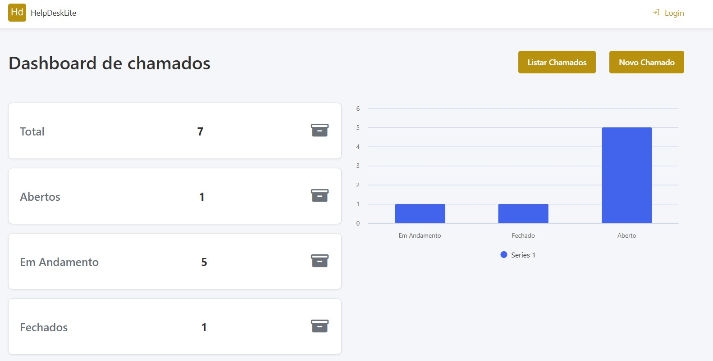
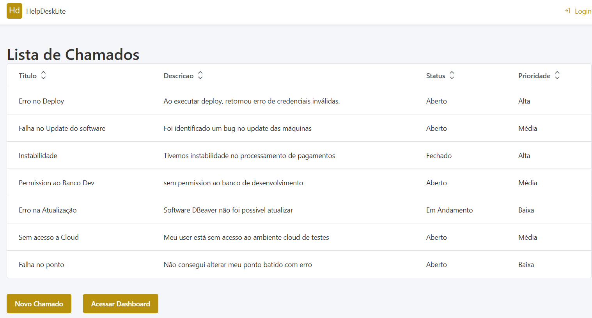
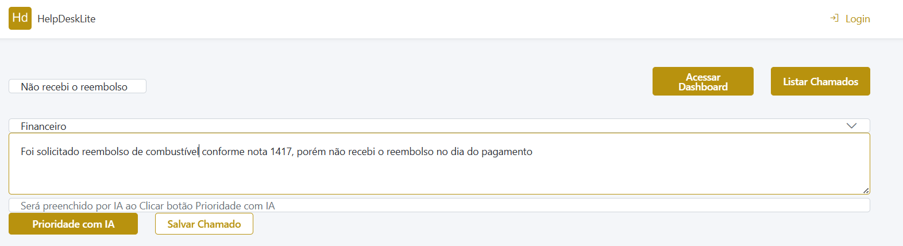
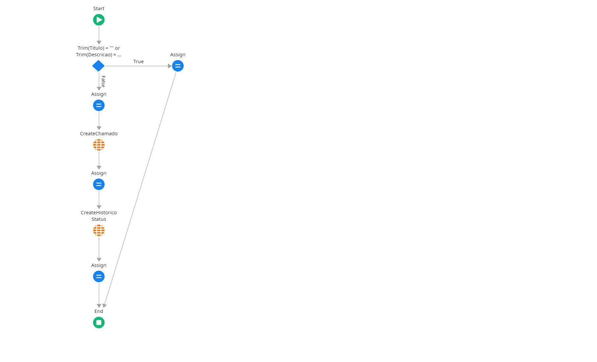
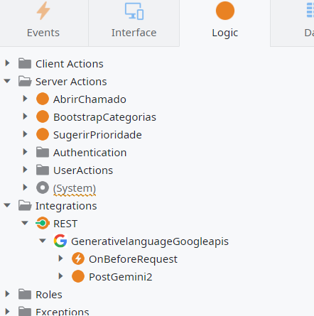
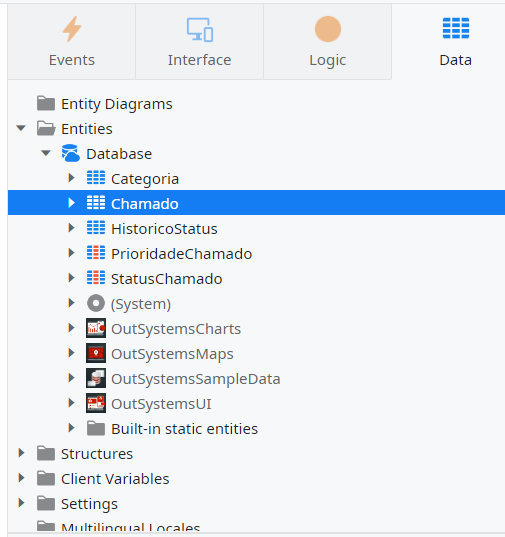
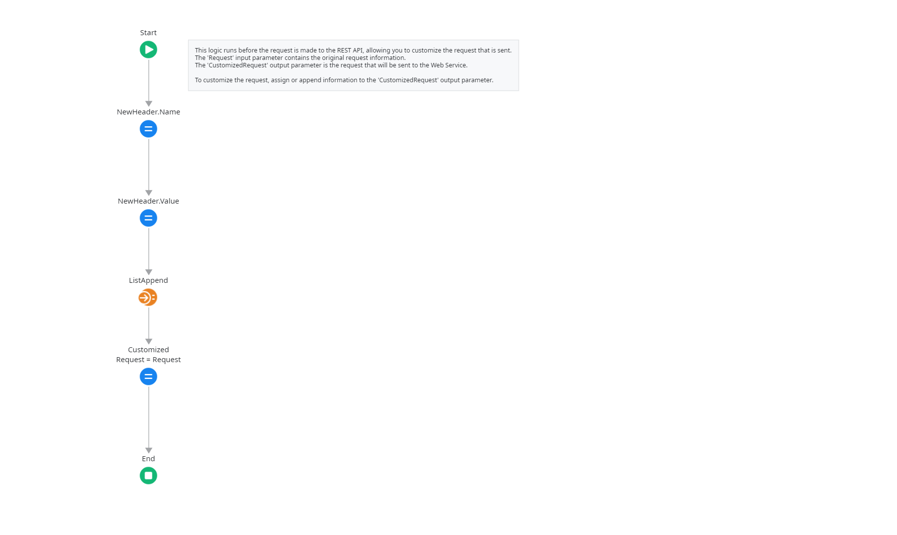
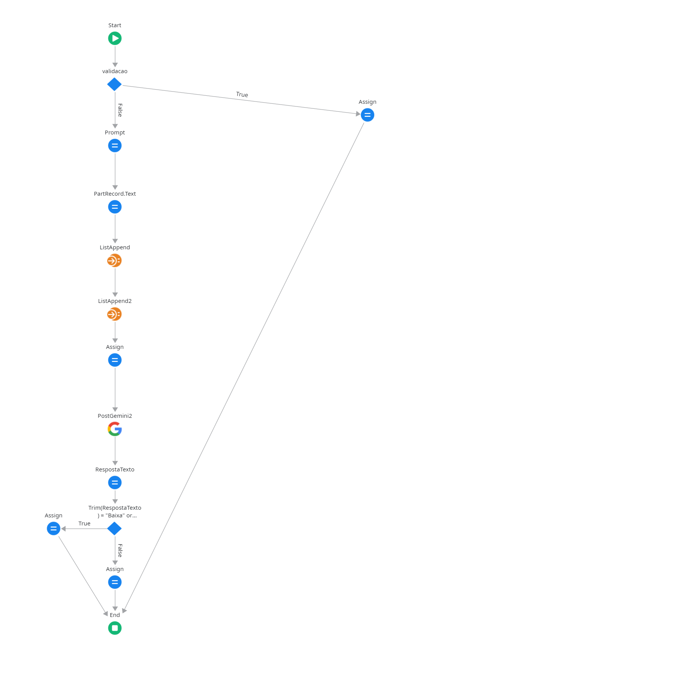

# HelpDesk Lite

> Sistema de Gestão de Chamados Internos com Priorização por IA  
> Desenvolvido em **OutSystems Developer Cloud (ODC)**

---

## Descrição do Sistema

O **HelpDesk Lite** é uma aplicação web low-code que centraliza a abertura, o acompanhamento e a priorização de chamados de suporte interno. O diferencial é a **priorização automática via IA** (Google Gemini 2.5 Flash-Lite, gratuito) que analisa o título e a descrição do chamado e sugere a prioridade mais adequada.

---

## Funcionalidades

| Funcionalidade | Status |
|---|---|
| Dashboard com 4 indicadores (Total, Abertos, Em Andamento, Fechados) | ✅ |
| Gráfico Column Chart por status (Forge — OutSystems UI Charts) | ✅ |
| Lista de chamados com dados em tempo real | ✅ |
| Abertura de chamado (formulário completo) | ✅ |
| Sugestão de prioridade por IA (Gemini 2.5 Flash-Lite) | ✅ |
| Navegação entre telas (Dashboard → Lista → Novo) | ✅ |
| Seed automático de 7 categorias | ✅ |
| 7 Server Actions (2 reais + 5 stubs) | ✅ |
| Histórico de status (HistoricoStatus) | ✅ |

---

## Arquitetura

A aplicação segue a **Canvas Architecture** do OutSystems, com 3 camadas lógicas dentro de uma única app:

```
╔══════════════════════════════════════════════╗
║  END USER LAYER (Interface)                  ║
║  Dashboard · ChamadosLista · ChamadoAbrir    ║
╠══════════════════════════════════════════════╣
║  CORE LAYER (Data + Logic)                   ║
║  Entidades · 7 Server Actions · Aggregates   ║
╠══════════════════════════════════════════════╣
║  FOUNDATION LAYER (Integrations)             ║
║  REST Gemini API · Secret Setting · SMTP     ║
╚══════════════════════════════════════════════╝
```

### Entidades de dados

```
Categoria ──< Chamado ──< HistoricoStatus
```

| Entidade | Campos principais |
|---|---|
| `Categoria` | Id, Nome, Descricao, Ativo |
| `Chamado` | Id, Titulo, Descricao, Status, Prioridade, CategoriaId, DataAbertura |
| `HistoricoStatus` | Id, ChamadoId, StatusAnterior, StatusNovo, DataAlteracao, AlteradoPor |

### Server Actions

| Action | Tipo |
|---|---|
| `SugerirPrioridade` | ✅ Real (Gemini API) |
| `AbrirChamado` | ✅ Real |
| `ObterEstatisticas` | Stub |
| `AtualizarStatus` | Stub |
| `FecharChamado` | Stub |
| `EnviarEmailNotificacao` | Stub |
| `ListarChamados` | Stub |

### Integração IA

- **Modelo:** Gemini 2.5 Flash-Lite (free tier)
- **Endpoint:** `generativelanguage.googleapis.com`
- **Auth:** Header `x-goog-api-key` via `OnBeforeRequest`
- **API Key:** Secret Setting `GeminiApiKey` (nunca hardcoded)
- **Fallback:** Prioridade "Média" em caso de erro

---

## Telas

| Tela | URL | Descrição |
|---|---|---|
| Dashboard | `/HelpDeskLite/Dashboard` | Indicadores + gráfico por status |
| Lista de Chamados | `/HelpDeskLite/ChamadosLista` | Todos os chamados |
| Abrir Chamado | `/HelpDeskLite/ChamadoAbrir` | Formulário + botão IA |

---

## Prints

### Dashboard — 4 cards + gráfico por status


### Lista de Chamados


### Abrir Chamado


### Fluxo Abrir Chamado


### Logic


### Data


### Fluxo OnBeforeRequest


### Fluxo Sugerir Prioridade com IA


---

## Como Testar

### Pré-requisitos

- Conta ODC com acesso à app `HelpDeskLite`
- Chave Gemini API configurada no ODC Portal → Secrets → `GeminiApiKey`

### Fluxo principal (5 minutos)

**1. Abrir a app**

**2. Dashboard**
- Vê 4 cards: Total, Abertos, Em Andamento, Fechados
- Clica **"Ver Chamados"** ou **"Novo Chamado"**

**3. Abrir novo chamado**

- Preenche **Título** (ex: "Servidor fora do ar")
- Seleciona **Categoria** (ex: Infraestrutura de TI)
- Preenche **Descrição** (ex: "O servidor principal parou de responder")
- Clica **"Sugerir Prioridade com IA"** → aguarda ~3s → prioridade preenchida
- Clica **"Salvar Chamado"**
- Redireciona para a lista

**4. Verificar na lista**
- Novo chamado aparece no topo

**5. Voltar ao Dashboard**
- Contador **Total** incrementado

### Dados de categorias (seed automático)

| # | Categoria |
|---|---|
| 1 | Infraestrutura de TI |
| 2 | Acesso e Permissões |
| 3 | Hardware e Equipamentos |
| 4 | Software e Sistemas |
| 5 | Recursos Humanos |
| 6 | Financeiro |
| 7 | Outros |

---

---

## Tecnologias

| Tecnologia | Uso |
|---|---|
| OutSystems Developer Cloud (ODC) | Plataforma low-code principal |
| Gemini 2.5 Flash-Lite (Google AI) | Sugestão de prioridade por IA |
| **OutSystems UI Charts (Forge)** | Column Chart no Dashboard (chamados por status) |
| REST API | Integração com Gemini |
| ODC Secret Settings | Armazenamento seguro da API Key |

---
